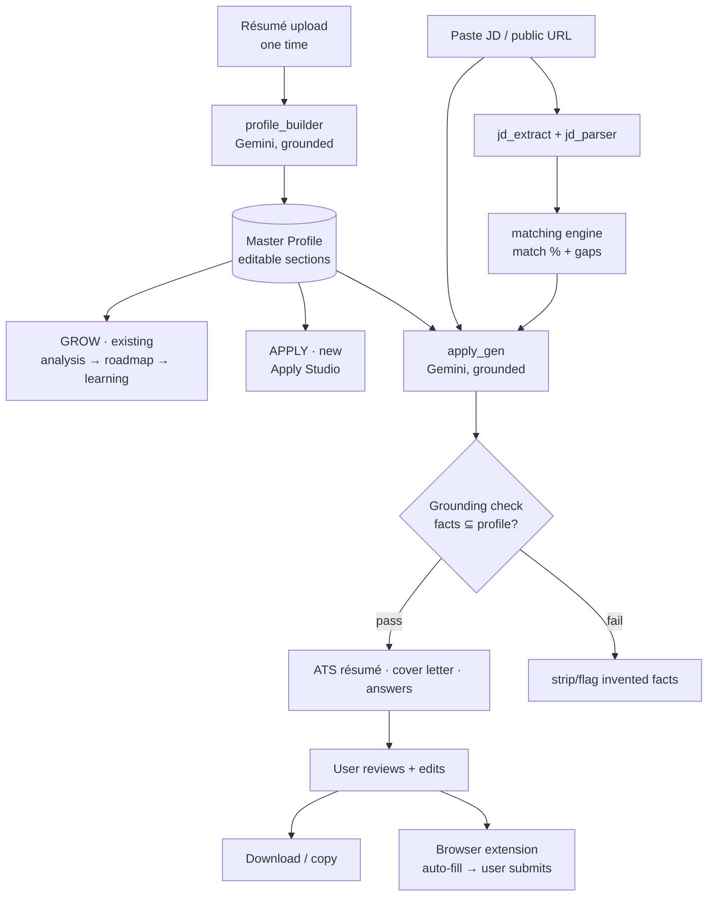
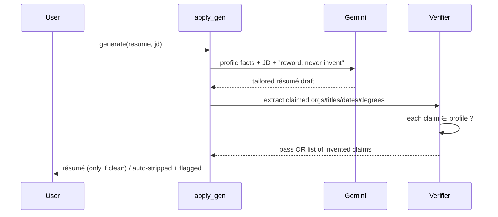

# PathFinderAI — Apply Assistant Architecture

Companion to [ARCHITECTURE.md](../ARCHITECTURE.md) and [plan-apply.md](plan-apply.md). Describes how the "apply once, apply everywhere" feature slots into the PathFinderAI stack **without** breaking the grounded, zero-fabrication design.

## 1. Where it fits — one profile, two superpowers



The **Master Profile is the new source of truth.** Both the existing Grow path (analysis/roadmap) and the new Apply path read from it, so a user maintains their information in exactly one place.

## 2. Components (reuse vs new)

| Layer | Reused | New |
|---|---|---|
| Engines | `resume_parser`, `taxonomy`, `jd_parser`, `matching`, provider/Gemini pattern | `profile_builder`, `jd_extract`, `apply_gen` |
| Data | Postgres + Alembic + `User` | `Profile`, `Application`, `GeneratedDoc`, `AnswerBank` |
| API | FastAPI, auth/deps, rate-limit + access-log middleware | `routers/profile.py`, `routers/apply.py` |
| Frontend | vanilla-JS SPA, wizard/CSS system, no-cache middleware | `#/profile`, `#/apply` views |
| Surface | — | Chrome MV3 extension (Phase C) |

## 3. Data model

```mermaid
erDiagram
  USER ||--|| PROFILE : has
  USER ||--o{ APPLICATION : creates
  APPLICATION ||--o{ GENERATEDDOC : produces
  USER ||--o{ ANSWERBANK : remembers

  PROFILE {
    string user_id PK_FK
    json   sections_json  "ordered typed sections (+custom)"
    string full_name
    string email
    string phone
    datetime updated_at
  }
  APPLICATION {
    string id PK
    string user_id FK
    string company
    string job_title
    string job_url
    text   jd_text
    json   jd_skills_json
    json   match_json
    string status  "draft|generated|applied"
    datetime created_at
  }
  GENERATEDDOC {
    string id PK
    string application_id FK
    string kind    "resume|cover_letter|answers"
    json   content_json
    string format
    datetime created_at
  }
  ANSWERBANK {
    string id PK
    string user_id FK
    text   question
    text   answer
  }
```

`sections_json` shape (flexible so custom sections need no schema change):
```json
[
  {"type":"personal","title":"Personal","fields":{"name":"…","email":"…","phone":"…","location":"…","links":[…]}},
  {"type":"experience","title":"Experience","items":[{"role":"…","org":"…","start":"…","end":"…","bullets":["…"]}]},
  {"type":"custom","title":"Patents","items":[{"heading":"…","detail":"…"}]}
]
```
All FKs `ON DELETE CASCADE`; ORM relationships mirror them so `delete account` wipes profile + applications + docs (matches the privacy policy).

## 4. Engines & the grounding guardrail

- **`profile_builder.py`** — `build_profile(resume_text) -> sections[]`. Gemini reads the résumé and returns typed sections; **grounded to the résumé text** (it structures, it doesn't invent). Deterministic fallback = heuristic section split + `taxonomy.extract_profile` for skills, so it degrades gracefully with no key.
- **`jd_extract.py`** — `extract(url|text) -> jd_text`. Pasted text passes through; a URL is fetched **only** for public/ATS hosts (Greenhouse/Lever/company pages) via `httpx`; blocked/JS-walled sites (LinkedIn/Indeed/Workday) return a "paste the description" prompt. Then `jd_parser` → required skills; `matching` → match % + gaps.
- **`apply_gen.py`** — `generate(profile, jd, kind, questions?)` via Gemini with a hard system rule: *use only facts present in the profile; reword/reorder/emphasize; never invent employers, titles, dates, degrees, or numbers.*

**The grounding check (the critical safety net):**

Employers, titles, dates, and degrees in the output must be a subset of the master profile; anything else is stripped and flagged. This is what makes "AI-tailored" safe to send.

## 5. API surface

```
POST /api/profile/from-resume   résumé (PDF/text) → structured sections (draft)
GET  /api/profile               master profile
PUT  /api/profile               edit/add/reorder/delete sections
POST /api/apply/extract         { url | jd_text } → { jd_text, skills, match }
POST /api/apply/generate        { application_id|jd, kinds[], questions? } → docs (grounded)
GET/POST /api/apply             list / create applications (tracker)
GET  /api/apply/{id}            application + generated docs
GET  /api/apply/{id}/export     ATS-clean résumé/CL (pdf|txt)
```
All under existing auth + rate-limit + access-log middleware.

## 6. Document export (dependency-light, ATS-first)

ATS parsers prefer plain, single-column, standard-heading text. So:
- Server returns **structured résumé JSON** + renders **ATS-clean HTML** (no tables/images/icons, standard fonts, reverse-chronological).
- Client offers **"Download PDF"** via browser print (`@media print` stylesheet) and **"Copy as text"** — zero native deps.
- **DOCX** (via `python-docx`) is a Phase-D add if users need editable Word files.

## 7. Browser extension (Phase C) — the only compliant auto-fill path

```mermaid
flowchart LR
  subgraph Job site (3rd party)
    F[Application form]
  end
  subgraph Extension (MV3)
    CS[Content script<br/>detect + map fields] --> F
    POP[Popup<br/>login · pick answers]
  end
  CS -->|token| API[(PathFinderAI API<br/>/api/profile, /api/apply)]
  API --> CS
  F -.user reviews + clicks submit.-> DONE[Submitted by user]
```
The extension reads field labels, maps them to profile values + generated answers via the API, fills them, and **stops** — the user reviews and submits. No auto-submit. Auth via the same JWT (extension stores it after login).

## 8. Security & privacy

- Master profile is PII-dense → **own-user access only**, encryption at rest (Cloud SQL default), **never logged** (the access-log middleware logs method/path/status only, no bodies).
- Cascade delete on account removal; pasted JDs/generated docs deletable.
- Extension holds only the user's JWT (same as web); no credentials to third-party sites are ever handled.
- Privacy policy updated to cover the profile store + JD processing (already lists Gemini as a processor).

## 9. Key decisions (ADR-style)

1. **Flexible `sections_json` over fully-normalized tables** — users add arbitrary custom sections; JSON avoids a migration per section type. Convenience columns (name/email/phone) stay indexed for fast autofill.
2. **Grounding verifier is mandatory, not optional** — the feature's integrity depends on never fabricating; it's a hard gate in `apply_gen`, not a prompt hope.
3. **No scraping, no auto-submit** — paste-text + public/ATS fetch only; human submits. Compliant and safe by construction.
4. **Extension is a separate deployable** — keeps the web app simple; the API is the contract between them.
5. **Reuse, don't rebuild** — `jd_parser`/`matching`/Gemini-provider patterns already exist and are grounded; Apply Studio composes them.

## 10. Build order

Phase A (Master Profile) → Phase B (Apply Studio) → Phase C (extension) → Phase D (DOCX, templates, AnswerBank, analytics). Each phase ships behind the existing Alembic + CI + rate-limit + no-cache hardening, so it's production-ready as it lands.
