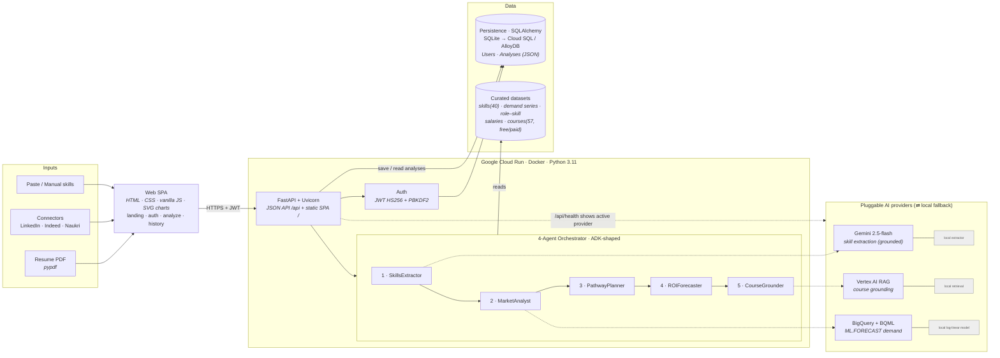

# PathFinderAI — Architecture & Tech-Stack Graph

> This graph maps every component, the data flow between them, and the technology behind each. It renders on GitHub and in Notion. Companion: [SPEC.md](../SPEC.md) · [ARCHITECTURE.md](../ARCHITECTURE.md) · [README.md](README.md).

## Architecture & data-flow graph

## Technology stack (by layer)

| Layer | Technology |
|---|---|
| **Frontend** | HTML5 · CSS3 (custom design system) · vanilla ES modules · hand-rolled SVG charts (no build step) |
| **Backend / API** | Python 3.11 · FastAPI · Uvicorn (ASGI) · Pydantic v2 · python-multipart |
| **Auth** | JWT (HS256) + PBKDF2-HMAC-SHA256 (stdlib only) |
| **AI — extraction** | Google **Gemini** `gemini-2.5-flash` (`google-generativeai`) ⇄ local taxonomy extractor |
| **AI — grounding** | **Vertex AI RAG** ⇄ local catalog retrieval |
| **AI — forecasting** | **BigQuery + BQML** `ML.FORECAST` (ARIMA_PLUS) ⇄ local log-linear model |
| **Orchestration** | Native 4-agent orchestrator + **ADK** `SequentialAgent` harness |
| **Parsing / docs** | pypdf (resume) · python-pptx (deck) |
| **Persistence** | SQLAlchemy ORM · SQLite (dev) → Cloud SQL / AlloyDB Postgres (prod) |
| **Data** | Curated JSON datasets (skills, demand series, role–skill matrix, salaries, courses) |
| **Infra / deploy** | Docker · **Google Cloud Run** · Cloud Build (project `promptwar-501405`, `asia-south1`) |
| **Live** | https://pathfinder-383713992026.asia-south1.run.app/#/ |

## Component legend

- **SkillsExtractor** — resume/profile → canonical skill IDs (Gemini, grounded to the taxonomy).
- **MarketAnalyst** — 3-year demand forecast per skill (rising ▲ / declining ▼).
- **PathwayPlanner** — profile × role–skill matrix → candidate roles by weighted coverage.
- **ROIForecaster** — ranks top 3 by composite score (coverage × demand × uplift × achievability); quantifies payoff.
- **CourseGrounder** — grounded courses per pathway in two tracks (Free Govt/YouTube · Paid).

*Pluggable-provider pattern: every AI capability runs on a deterministic local implementation by default and upgrades to the Google Cloud service when its env var is set — the app is fully functional with zero cloud credentials and never breaks (providers fail-open to local).*
