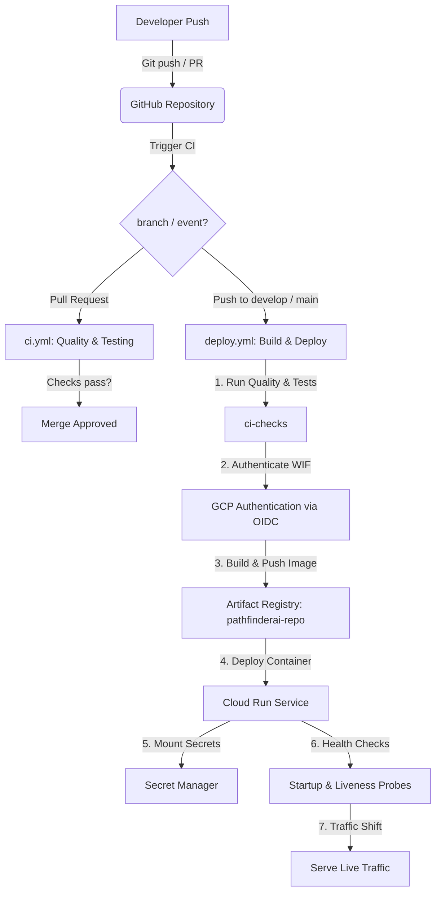

# PathFinderAI CI/CD Architecture & Operations Manual

This document details the CI/CD pipeline setup for deploying the PathFinderAI application to Google Cloud Run from GitHub.

---

## 1. CI/CD Architecture

The deployment pipeline is fully automated and secure, utilizing **GitHub Actions**, **Google Cloud Workload Identity Federation (WIF)**, **Artifact Registry**, and **Secret Manager**. No long-lived Service Account JSON keys are used.



---

## 2. Required Google Cloud Resources

All resources are provisioned in the **`pathfinderai-503505`** Google Cloud project under region **`asia-south1`**.

| Resource Name | Service | Purpose |
|---|---|---|
| `pathfinderai-repo` | Artifact Registry | Docker container repository (DOCKER standard format) |
| `pathfinderai` | Cloud Run | Production service environment (built from `main` branch) |
| `pathfinderai-dev` | Cloud Run | Staging/Development service environment (built from `develop` branch) |
| `github-actions-deployer` | IAM Service Account | Deployer SA used by GitHub Actions (authorized via WIF) |
| `pathfinderai-runner` | IAM Service Account | Runtime SA used by Cloud Run container instances to access resources |
| `github-actions-pool` | Workload Identity Pool | Pool for managing OIDC tokens from GitHub Actions |
| `github-actions-provider` | Workload Identity Provider | OIDC provider mapping `token.actions.githubusercontent.com` to GCP |
| Secrets (see below) | Secret Manager | Secure storage for sensitive API keys and configuration |

---

## 3. Secret Manager Configuration

Cloud Run retrieves these secrets dynamically on startup as environment variables.

| Secret Name | Purpose | Recommended Default |
|---|---|---|
| `JWT_SECRET` | Signing token for session auth | Secure random string (automatically generated on setup) |
| `GEMINI_API_KEY` | Google Gemini API key | Active API Key |
| `RAPIDAPI_KEY` | JSearch API key (RapidAPI) | Active API Key |
| `ADZUNA_APP_ID` | Adzuna application ID | Active App ID |
| `ADZUNA_APP_KEY` | Adzuna application key | Active App Key |
| `SMTP_USER` | SMTP server username | SMTP username |
| `SMTP_PASSWORD` | SMTP server password | SMTP password |
| `DIGEST_TOKEN` | Auth token for cron digest endpoint | Secure random string |
| `DATABASE_URL` | Postgres Database connection URL | `sqlite:///./pathfinderai.db` (ephemeral SQLite fallback) |

---

## 4. Required GitHub Secrets

You must add the following Repository Secrets to your GitHub repository (`ojha-436/PathfinderAI`):

*   **`GCP_WORKLOAD_IDENTITY_PROVIDER`**: The Workload Identity Provider resource name.
    *   Format: `projects/[PROJECT_NUMBER]/locations/global/workloadIdentityPools/github-actions-pool/providers/github-actions-provider`
*   **`GCP_SERVICE_ACCOUNT`**: The email of the deployer service account.
    *   Format: `github-actions-deployer@pathfinderai-503505.iam.gserviceaccount.com`

---

## 5. Branch Protection Recommendations

To maintain high code quality and secure deployments, configure these rules for the `main` and `develop` branches:

1.  **Require a pull request before merging**: Prevent direct pushes to production and staging branches.
2.  **Require status checks to pass before merging**: Check the `ci-checks` status check so that linting and unit tests must pass before code is merged.
3.  **Prevent force pushes**: Prevent rewriting Git history on shared branches.
4.  **Require linear history**: Force squash-merge or rebase-merge to keep clean history logs.

---

## 6. Rollback Procedures

If a deployment introduces issues, you can roll back using either method:

### Method A: Automated Cloud Run Rollback (Zero Downtime)
If the container fails the startup or liveness health check probes on deployment:
*   Cloud Run will **automatically abort** the traffic shift.
*   100% of traffic remains on the previous healthy revision.
*   The deployment job in GitHub Actions fails, but the live site is unaffected.

### Method B: Manual Revision Rollback via gcloud CLI
To manually roll back to a known stable version:
1.  List the revisions of the service:
    ```bash
    gcloud run revisions list --service=pathfinderai --region=asia-south1
    ```
2.  Route 100% of traffic to the stable revision (e.g., `pathfinder-00002-abc`):
    ```bash
    gcloud run services update-traffic pathfinderai \
      --to-revisions=pathfinderai-00002-abc=100 \
      --region=asia-south1
    ```

### Method C: Manual Rollback via GitHub Actions
Locate a previous successful run in the GitHub Actions **Actions** tab, click **Re-run all jobs**, which rebuilds and redeploys that exact commit.

---

## 7. Troubleshooting Guide

### 1. Permission Denied on Storage Staging Bucket
*   **Error**: `IAM permission denied for service account [PROJECT_NUMBER]-compute@developer.gserviceaccount.com`
*   **Fix**: Run the following to grant the service account permissions on the project:
    ```bash
    gcloud projects add-iam-policy-binding pathfinderai-503505 \
      --member="serviceAccount:[PROJECT_NUMBER]-compute@developer.gserviceaccount.com" \
      --role="roles/storage.objectViewer"
    ```

### 2. GitHub Actions Authentication Fails (WIF Issues)
*   **Error**: `Could not load credentials from Workload Identity Provider...`
*   **Fix**: Verify that the repository name matches `ojha-436/PathfinderAI` exactly, and confirm that the project number in `GCP_WORKLOAD_IDENTITY_PROVIDER` is correct.

---

## 8. Disaster Recovery Notes

If the Google Cloud project is deleted or needs rebuilding from scratch:
1.  Create a new GCP project and authenticate via `gcloud auth login`.
2.  Run the infrastructure script:
    ```bash
    ./infra/setup_gcp_cicd.sh [NEW_PROJECT_ID]
    ```
3.  Update the GitHub secrets `GCP_WORKLOAD_IDENTITY_PROVIDER` and `GCP_SERVICE_ACCOUNT` with the new project values.
4.  Commit any code change or run manual workflow dispatch to rebuild and deploy the app.
